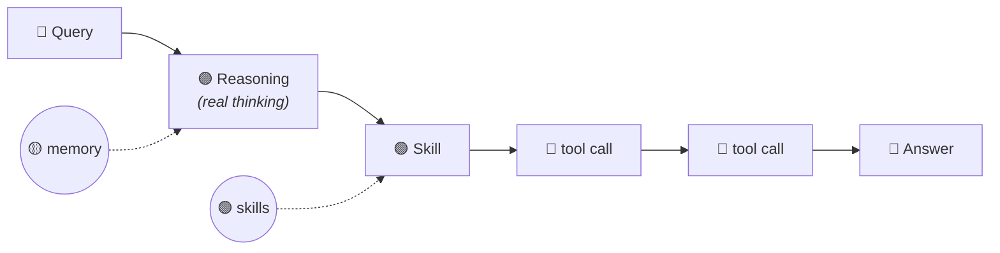

<div align="center">

# 🗺️ Claude Trace Map

### See what Claude *actually* did — straight from the logs.

A native desktop app that turns real **Claude Code** session transcripts into an
interactive **3D star-field**: the path your query took, the memory & skills your
assistant has, where your tokens go — and one-click hand-offs to **add** or
**fix** memory and skills right from a real run.

`trace map` · `query route` · `/trace_map`

</div>

---

## Why

Most "agent observability" tools either show a flat 2D graph or — worse — draw a
tidy decision flowchart that **doesn't actually exist**. Claude doesn't run a
hard-coded router; it reads context (injected memory + skill descriptions) and
decides. Trace Map is built around that truth:

> **Honesty first.** The route, reasoning, tool/skill calls, tokens and errors
> are read **straight from the transcript**. The memory/skill "stars" come from
> your filesystem config (`MEMORY.md`, `~/.claude/skills`) and are **labelled as
> config** — the tool never fakes a routing decision the log doesn't contain.

---

## ✨ What's inside

A single window with a five-card menu:

### 🧠 Claude's Mind — the assistant's mind
A constellation around a central **Claude** node:
- 🟡 **Memory** — ranked by type (`user` > `feedback` > `project` > `reference`)
  and inbound `[[links]]`. Bigger star = more central.
- 🟢 **Skills** — ranked by how often they're actually used in recent sessions.

Click any star for its description and source.

### 🛤️ Recent queries — the route of a real query
Pick one of your last queries and watch its **3D route** light up:



- Numbered, arrowed, readable steps — no hunting for a moving dot.
- Each step shows **tokens & time**; failed tool calls glow **red**.
- The exact sentence where the model **decided** to call a skill (from real
  `thinking`).
- A plain-language **"Simple"** story + a **"Technical"** toggle for raw args.

### 💰 Spend — where your tokens go
A dashboard across recent sessions: total **≈ $**, tokens in→out, **cache-hit
rate**, your most expensive queries, and a breakdown **by skill** — all from the
real `usage` fields in the logs.

### 🔴 Live — watch it think
Polls the current transcript and **rebuilds the route in real time** as you talk
to Claude. The map grows step-by-step: query → reasoning → tool calls → answer.

### ➕ Add + 🔧 Fix this — act, don't just look
The killer loop. Buttons hand off back into the chat:
- **➕ Add memory/skill** — fill type + name + description; Claude continues
  creating it in the conversation, properly formatted.
- **🔧 Fix this** — on a query that went wrong (errors, redundant calls, a skill
  that should have fired), Claude receives the route + diagnosis, proposes a
  **minimal fix** to the skill/memory/prompt, and offers to **re-run** the same
  query so a fresh trace proves it improved. A closed improvement loop, anchored
  to a **real logged run** — not synthetic guesses.

---

## 🚀 Install

```bash
# as a Claude Code skill
git clone https://github.com/alekseylifanov333/claude-trace-map.git \
  ~/.claude/skills/trace-map
pip3 install -r ~/.claude/skills/trace-map/requirements.txt
```

Then just ask Claude: **`/trace_map`** (or "show the query route").

> Three.js loads from a CDN, so the window needs internet on first open.
> macOS-first (pywebview / WKWebView); Linux & Windows use their platform webview.

---

## 🎬 Standalone use

You don't need the skill to render a single trace:

```bash
python3 scripts/trace_app.py        # full app (menu + all views)
python3 scripts/trace_map.py        # render the latest query to one HTML file
python3 scripts/trace_map.py path/to/session.jsonl
```

---

## 🧠 How it works

Claude Code writes every session to `~/.claude/projects/<project>/<id>.jsonl`.
Trace Map parses those transcripts and reconstructs, per exchange:

| From the **log** (faithful) | From **config** (labelled) |
|---|---|
| user query, `thinking`, tool/skill calls + args, results, final answer | which memory entries exist (`MEMORY.md`) |
| per-message tokens (input / output / **cache**), turn timings | which skills are installed (`~/.claude/skills`) |
| tool errors (`is_error`), the model used | importance ranking heuristics |

The window is a self-contained HTML page (Three.js) opened in a native window via
[`pywebview`](https://pywebview.flowrl.com/). The **add/fix** buttons talk to
Python through pywebview's JS-API, which writes a `handoff.json` and closes the
window — returning control to Claude, which reads the hand-off and continues.

---

## ⚠️ Honest limitations

- The full *injected* context (which memories actually surfaced) isn't persisted
  in the transcript, so memory-recall detection is **best-effort** (matched from
  `system-reminder` text) and may under-report.
- Importance ranking is heuristic, not ground truth.
- It parses an **undocumented** transcript format — a Claude Code update can
  change it.
- 3D is engaging, but for pure "what happened" the side-panel text does the real
  work.

It's most valuable for people who **build and tune** assistants (debugging
behaviour, pruning memory, fixing skill triggers) and for explaining "how does
this thing actually work" to newcomers.

---

## 🛠 Tech

Python · [pywebview](https://pywebview.flowrl.com/) · [Three.js](https://threejs.org/) · zero build step.

## 📄 License

MIT
